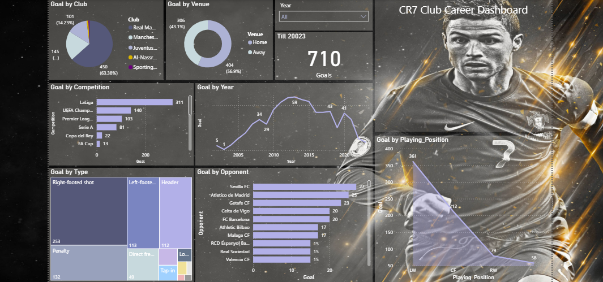

# ⚽ CR7 Club Career Dashboard - Power BI Project

This project presents an interactive Power BI dashboard visualizing the club career statistics of Cristiano Ronaldo (CR7). It highlights his incredible goal-scoring journey across different clubs, competitions, and positions over the years.

## 🎯 Objective

The goal of this project is to provide a detailed visual breakdown of Cristiano Ronaldo's **710** club goals by multiple dimensions such as year, opponent, venue, and goal type — all in a compelling, user-friendly dashboard.

## 📌 Dashboard Highlights

- **Total Goals:** 710 (Club Career)
- Goals categorized by:
  - ⚽ **Club** (Real Madrid, Manchester United, Juventus, etc.)
  - 📍 **Venue** (Home vs Away)
  - 🏆 **Competition** (La Liga, UEFA Champions League, etc.)
  - 🕒 **Year** (2002–2023)
  - 👟 **Goal Type** (Right-footed, Header, Penalty, etc.)
  - 📊 **Opponent** (Top clubs Ronaldo scored against)
  - 🧍 **Playing Position** (LW, CF, RW)

## 🛠 Tools Used

- **Power BI** for data visualization
- **Excel** for data preprocessing and structuring

## 🚀 How to Use

1. Clone this repository.
2. Open the `.pbix` file in Power BI Desktop (if provided).
3. Use slicers (Year, Club, Venue) to explore the data dynamically.

## 🧠 Insights Extracted

- Ronaldo scored the most club goals at **Real Madrid**.
- His most frequent goal type: **Right-footed shot**.
- **Sevilla FC** is the opponent he scored most against.
- Peak goal-scoring year: **2014** with **59** goals.
- Most goals were scored while playing as a **Left Winger (LW)**.

## 🙋‍♂️ Author

**Rifat Abdullah Dipu**  
📧 Email: rifatdipu@gmail.com  
🔗 https://www.linkedin.com/in/rifatdipu/

---

